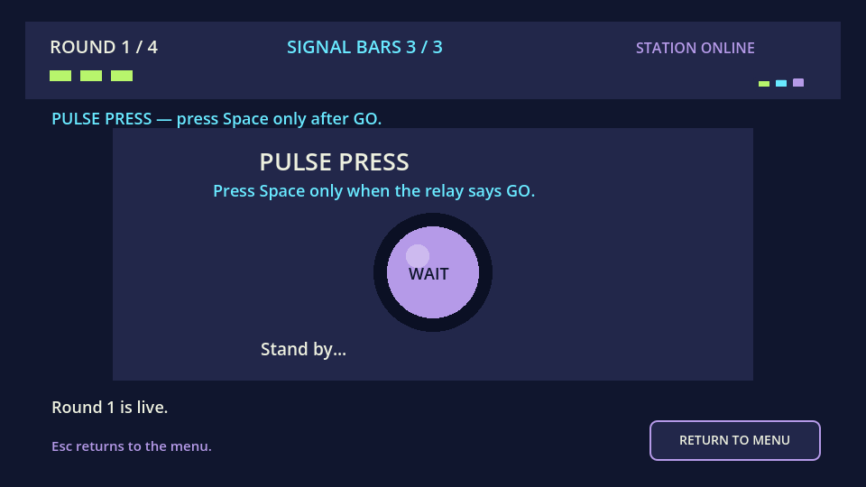
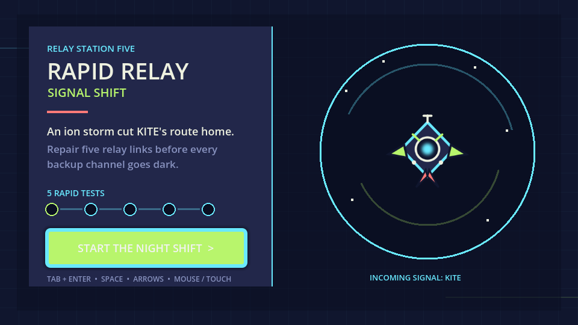
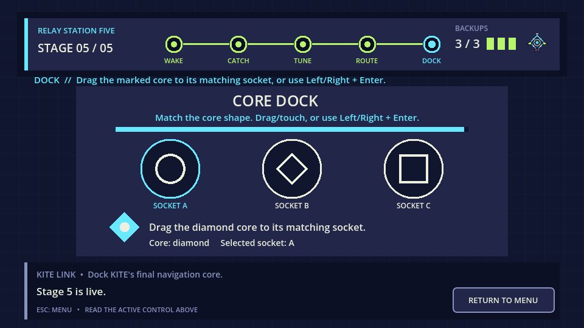
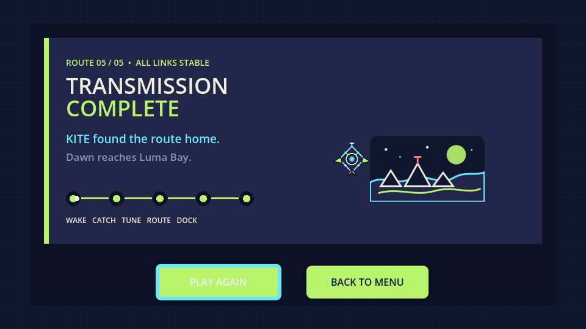
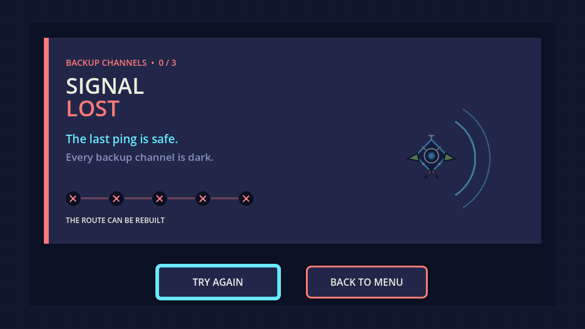

# Rapid Relay: Signal Shift

An original Godot reflex-game collection about rebuilding a courier drone's route through an ion storm.



**[Existing browser demo — five-game update pending](https://aaravkatiyar55-gif.github.io/rapid-relay-signal-shift/)** · [View the source](https://github.com/aaravkatiyar55-gif/rapid-relay-signal-shift)

## What it is

You are the night-shift operator at Relay Station Five. An ion storm has scattered the navigation signal of KITE, a small courier drone trying to reach Luma Bay. Read one instruction, react quickly, and repair five links before all three backup channels go dark.

This is a standalone practice project with its own setting, character, interface, assets, win scene, and failure scene. It does not use Nintendo characters, art, music, names, or UI.

## Quick start

1. Install Godot 4.7 or a compatible Godot 4 release.
2. Open `project.godot` and press **F5**.
3. Use the active control shown above each challenge.

## Features

- Five different input-driven minigames in a fixed story sequence.
- Keyboard, mouse, and touch controls, with keyboard alternatives for pointer challenges.
- Three visible backup channels with text, shape, and colour feedback.
- Five-node route HUD that records successful and recovered stages.
- Original KITE/Luma Bay story, animated menu, win scene, and failure scene.
- 960×540 Godot 4 Web-compatible build with project-specific local SVG art.

## The five relay repairs

### 1. Pulse Press — Wake

Wait for the lamp to say `GO`, then press **Space** inside the 0.85-second response window. Pressing early or late uses a backup.

### 2. Orb Catch — Catch

Catch the moving orb before it escapes. Click or tap it, or move the keyboard reticle with the **Arrow keys** and press **Enter**.

### 3. Wave Tuner — Tune

Use **Left** and **Right** to move the needle. Keep it inside the stable band for 0.55 seconds before the 4.5-second timer expires.

### 4. Relay Route — Route

Enter the four visible **Arrow keys** in order before the route timer runs out. A wrong arrow breaks the stage.

### 5. Core Dock — Dock

Drag the diamond navigation core into the matching socket. A keyboard player can choose a socket with **Left/Right** and dock with **Enter**.

## Controls

- **Tab / Enter:** navigate and activate menu or ending buttons.
- **Space:** Pulse Press.
- **Arrow keys:** Orb reticle, Wave Tuner, Relay Route, and Core Dock selection.
- **Mouse / touch:** Orb Catch and Core Dock.
- **Esc:** return to the main menu during a run or ending screen.

## How the game works

`Game.tscn` owns one ordered five-stage plan. It instantiates the correct minigame scene, listens for one `finished(success)` result, updates the route HUD, and moves to the next stage. A small shared minigame base blocks duplicate results and gives each result a short readable pause.

A failure consumes one backup but automatically repairs that stage, so the story can continue. Losing the third backup opens **Signal Lost**. Reaching the end with at least one backup opens **Transmission Complete**.

## Run and test locally

Open a PowerShell terminal in the project folder and replace the executable name if Godot is installed somewhere else:

```powershell
Godot_v4.7.1-stable_win64_console.exe --headless --path . --script res://tests/press_logic_test.gd
Godot_v4.7.1-stable_win64_console.exe --headless --path . --script res://tests/catch_logic_test.gd
Godot_v4.7.1-stable_win64_console.exe --headless --path . --script res://tests/wave_logic_test.gd
Godot_v4.7.1-stable_win64_console.exe --headless --path . --script res://tests/route_logic_test.gd
Godot_v4.7.1-stable_win64_console.exe --headless --path . --script res://tests/dock_logic_test.gd
Godot_v4.7.1-stable_win64_console.exe --headless --path . --script res://tests/flow_test.gd
Godot_v4.7.1-stable_win64_console.exe --headless --path . --script res://tests/navigation_test.gd
```

The 2026-08-24 run completed **80 assertions across seven suites with zero failures**. Detailed observed results and test boundaries are in [docs/TESTING.md](docs/TESTING.md).

## Screenshots

All images below were captured from the actual local Godot 4.7.1 runtime on 2026-08-24.









## Assets and credits

- Built with Godot 4.7 and GDScript.
- Uses Godot's built-in fallback font.
- Project-specific SVGs in `assets/`: relay icon, signal bars, result stamps, KITE drone, Luma Bay, and the neon boot-splash source. The matching boot-splash PNG was rendered locally from that source for Godot's required format.
- No downloaded sprite pack, external font, music, or Nintendo asset is included.

The source, visual assets, story copy, tests, and documentation in this practice build were produced with substantial OpenAI Codex assistance. They are stored in the repository so their origin is not hidden.

## Known limitations

- No sound effects or high-score system.
- The gameplay HUD is drawn on the Godot canvas and does not currently expose a screen-reader text layer.
- The fixed 960×540 game canvas scales in the browser instead of rearranging into a phone-specific layout.
- Automated logic tests and runtime screenshots are not a substitute for a person completing every route manually.
- Browser automation verified loading, clean console output, menu rendering, and keyboard start; background canvas timing made a complete automated browser playthrough unreliable.
- This substantial AI-assisted build must not be represented as satisfying a none-to-minimal-AI mission without explicit organizer confirmation.

## AI disclosure

OpenAI Codex was used for project setup, game design, GDScript implementation, visual assets, debugging, automated tests, screenshots, documentation, Web-export support, and repository/deployment work.

This is an AI-assisted practice project. No claim of human-only authorship, five human coding hours, or mission eligibility is made here.
